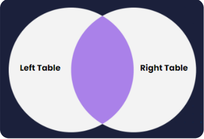
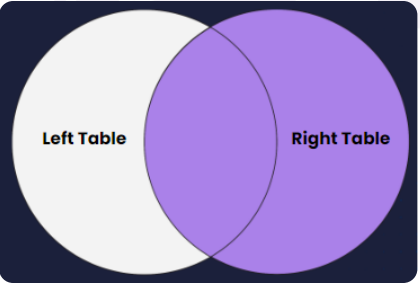
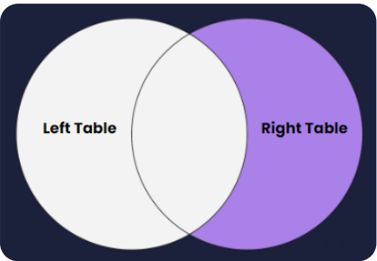
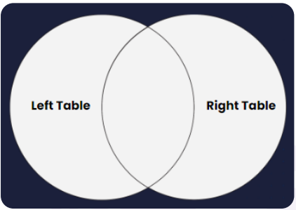

# Explain the deffernt type of Joins ?

- Join are majorly catagorized in four types. Let's understand each one before moving the concept how it works.

1. Inner Join
2. Left Join
3. Right Join
4. Full Join

## 1. Inner Join :

 

> If we join left table and right table then we get the common data which is present in both left and right side table.

## 2. Right Join :

> If join right table then we get total data of right table and from left table only get which data is common with right table.

## 3. Left Join :

> If we join left table then get total data of left table and common data with left table from right table .

## 4. Full Join :

> If you join two table left and right then we get total data of both the table.
