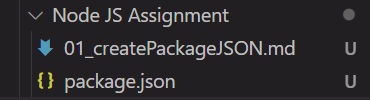

# Create Packages.json file using npm init command.

Package.json file is like javascript object but it's not similar with javascript.
For create Package.json file first we need to known basic understanding of `Npm commands`.

**1st Step :**
First open terminal and choose the directory or path for create `package.json` folder.

```npm
 npm init
```

**2nd Step :**

```npm

package name: (node-js-assignment) node-js
version: (1.0.0) 1.0.5
description: create node js package.json file
entry point: (index.js)
test command: test
git repository:
keywords: node.JS , package.json , Node Assignment
author: Tufan pandu
license: (ISC) ISC
About to write to C:\PW Skills MERN\MERN-Stack-Developer\ASSIGNMENTS\Node JS Assignment\package.json:

{
  "name": "node-js",
  "version": "1.0.5",
  "description": "create node js package.json file",
  "main": "index.js",
  "scripts": {
    "test": "test"
  },
  "keywords": [
    "node.JS",
    "package.json",
    "Node",
    "Assignment"
  ],
  "author": "Tufan pandu",
  "license": "ISC"
}


Is this OK? (yes)
```


