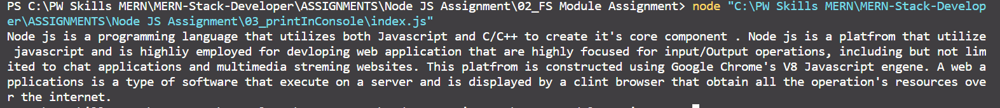

# Print the node js architecture information to console using node.js fs module form nodejs_architecture.txt.

**Step -1**

Using Node js modules read the file and print the information to the console.

```node
const fs = require("fs");

fs.readFile("nodejs_architecture.txt", function (err, data) {
  if (err) {
    console.log("Not able to read file : " + err);
  } else {
    console.log(data.toString());
  }
});
```

**Output**


