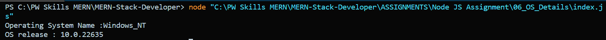

# We Have some OS Details of Computer.

```node
const os = require("os");

console.log("Operating System Name :" + os.type()); // It's gives Operating System name.

console.log("OS release : " + os.release()); // It's gives OS release date.
```


