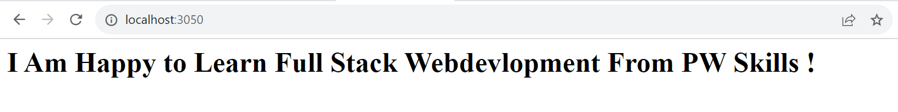

# Create HTTP server and print content to browser .

**Code**

```nod
const http = require("http");

const PORT = 3050;
const hostname = "localhost";
const server = http.createServer(function(req,res){
    if(req.url == "/"){
       res.statusCode  = 200;
       res.setHeader("content-type", "text/html");
       res.end("<h1'>I Am Happy to Learn Full Stack Webdevlopment From PW Skills !</h1>");
    }else{
        res.statusCode = 500;
        res.setHeader("content-type", "text/plain");
        res.end("Showing Error !")
    }
});

server.listen(PORT , function(){
    console.log(`We are in this sever ${hostname}:${PORT}.`);
})

```


