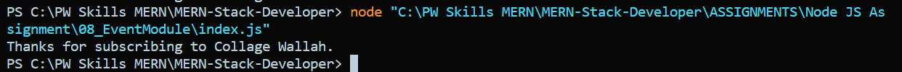

# Using Event module trigger the event.

**code**

```node
const EventEmitter = require("events"); //EventEmitter - Class

const event = new EventEmitter(); //event  - Object

event.on("subscribe", (channelName) => {
  console.log(`Thanks for subscribing to ${channelName}.`);
});

event.emit("subscribe", "Collage Wallah");
```


